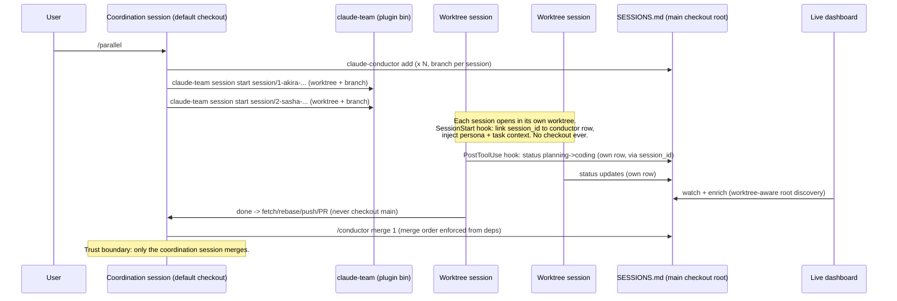

# Fable 5 + Claude Code Harness Modernization Analysis

> Scope: [claude-team-cli](https://github.com/code-katz/claude-team-cli) (v0.6, last updated 2026-04-09) and [claude-conductor](https://github.com/code-katz/claude-conductor) (v1.0), audited against the Claude Code harness and Claude 5 model family as of 2026-07-03.
> Lead: Akira (Backend Engineering). Harness facts verified against official docs at code.claude.com/docs; file references point at current `main` of each repo.

---

## 1. Executive Summary

Both tools still function, but they encode a snapshot of the harness from roughly March 2026. The drift falls into three clusters:

1. **Correctness defects that break the parallel-persona workflow today.** The `/parallel` command tells sessions to `git checkout -b` in one shared working tree, the persona switcher mutates a single global `~/.claude/CLAUDE.md`, the conductor's repo-root detection fails inside git worktrees, and `conductor-hook` has a broken one-shot guard and is never registered. These are not cosmetic: they undermine the exact merge-queue and git-hygiene guarantees the conductor exists to provide.
2. **Stale model and cost assumptions.** The dashboard prices three retired model IDs, silently bills every unknown model (including `claude-fable-5`) at Sonnet 4.6 rates, and hardcodes a 200k context window.
3. **Missed harness-native surfaces.** Plugins, subagents, skill frontmatter, SessionStart hooks, native worktrees (`claude --worktree`), and per-persona model selection all exist now and map directly onto what these tools hand-roll.

**Top five actions, in order:**

| # | Action | Repo | Why first |
|---|--------|------|-----------|
| 1 | Rewrite `/parallel` to use worktree isolation instead of `git checkout -b` in a shared tree | team-cli (+ conductor guidance) | Only correct way to run simultaneous personas; everything else assumes it |
| 2 | Make persona activation session-scoped (skills/subagents), not global CLAUDE.md mutation | team-cli | Two personas at once is the whole point; global state makes it a race |
| 3 | Fix worktree-blind repo-root detection (`.git` file vs directory) | conductor | Dashboard and CLI silently fail inside every worktree the fix in #1 creates |
| 4 | Replace the hardcoded pricing map with a config-driven table covering the Claude 5 lineup; surface unknown models instead of silently defaulting | conductor | Cost numbers are currently wrong for every 2026 model |
| 5 | Package both repos as Claude Code plugins (skills + agents + hooks + bin) | both | Fixes distribution, hook registration, and PATH concerns in one move |

---

## 2. Harness State of the World (verified July 2026)

Facts below were verified against official documentation; each drives at least one finding.

| Fact | Source | Implication here |
|------|--------|------------------|
| `.claude/commands/*.md` still work; commands were merged into skills. Skills add frontmatter: `description`, `allowed-tools`, `disable-model-invocation`, `user-invocable`, `model`, `effort`, `context: fork`, `agent`, `hooks`, `argument-hint` | code.claude.com/docs/en/skills.md | No forced migration, but persona commands should gain frontmatter or become skills for permission pre-approval and discoverability |
| Plugins are the recommended distribution mechanism: `.claude-plugin/plugin.json` bundling `skills/`, `commands/`, `agents/`, `hooks/hooks.json`, `.mcp.json`, `settings.json`, and `bin/` (added to PATH) | code.claude.com/docs/en/plugins.md | Replaces both repos' `install.sh` copy-into-`~/.claude` approach; solves hook registration and CLI PATH setup |
| Subagents: `.claude/agents/*.md` with `name`, `description`, `tools`, `model`, `skills`, `background`, `isolation: worktree`, `permissionMode` | code.claude.com/docs/en/sub-agents.md | Personas can be delegable agents with per-persona model and tool scoping |
| Agent teams (lead + teammates, shared task list, direct messaging, `TaskCreated`/`TaskCompleted`/`TeammateIdle` hooks) exist but are EXPERIMENTAL, off by default (`CLAUDE_CODE_EXPERIMENTAL_AGENT_TEAMS=1`) | code.claude.com/docs/en/agent-teams.md | Overlaps the conductor's core value; not yet a replacement. Track, do not depend |
| Native worktrees: `claude --worktree <name>` / `claude -w` creates `.claude/worktrees/<name>/`, base `origin/HEAD` (configurable), auto-cleanup, `WorktreeCreate`/`WorktreeRemove` hooks | code.claude.com/docs/en/worktrees.md | The isolation `/parallel` needs already ships in the CLI |
| Hook events now include `SessionStart`, `SessionEnd`, `PostToolUse`, `PostToolUseFailure`, `TaskCreated`, `TeammateIdle`, `WorktreeCreate`, `PreCompact`, and ~20 more; hook stdin JSON carries `session_id`, `cwd`, `tool_name`, `tool_input`, `transcript_path` | code.claude.com/docs/en/hooks.md | `conductor-hook` should key off `session_id` from stdin; the conductor roadmap's SessionStart hook is now buildable |
| JSONL transcripts under `~/.claude/projects/<encoded-cwd>/` are documented as INTERNAL: "scripts that parse these files directly can break on any release" | code.claude.com/docs/en/sessions.md | The live dashboard's core input is explicitly unstable; needs defensive parsing and contract tests |
| Model lineup: `claude-fable-5` (fable), `claude-opus-4-8` (opus), `claude-sonnet-5` (sonnet), `claude-haiku-4-5` (haiku). Reported rates per MTok: Fable $10/$50, Opus 4.8 $5/$25, Sonnet 5 intro $2/$10 (standard $3/$15 after 2026-08-31), Haiku 4.5 $1/$5. Cache reads discounted 90%; fast mode 2x on Fable/Opus | platform.claude.com/docs pricing/models | Every entry in the conductor's pricing map is stale; Sonnet 5 has a scheduled price change, which argues for config over constants |
| Permission modes: `default`, `acceptEdits`, `plan`, `auto`, `dontAsk`, `bypassPermissions` | code.claude.com/docs/en/cli-reference.md | Dashboard badge logic handles four; coordinator prose describes three |
| `TodoWrite` is retired; task tracking is `TaskCreate`/`TaskUpdate`/`TaskList` | current harness | coordinator-prod.md references TodoWrite by name |
| Output styles: feature alive, but the `/output-style` command was removed in v2.1.91 | code.claude.com/docs/en/output-styles | Neither repo uses them; no action, noted so nobody migrates personas onto a deprecated command |

Pricing figures should be re-verified against platform.claude.com at implementation time; the architectural recommendation (config-driven pricing, no silent fallback) holds regardless of the exact numbers.

---

## 3. claude-team-cli Findings

### T1. CRITICAL: Persona activation is a global singleton that races parallel sessions

`bin/claude-team` `cmd_use` (bin/claude-team:104) splices the persona profile into `~/.claude/CLAUDE.md` between `<!-- CLAUDE-TEAM:START/END -->` markers. That file is global user memory, read by every session in every project:

- Terminal 1 activates Akira, terminal 2 activates Sasha: the second write replaces the first. Any newly started session sees only the last writer.
- The `/akira`-style commands adopt the persona in-context (which works), but each one also runs `claude-team use <name>` (commands/akira.md:1), so parallel sessions actively fight over the global block while running.
- `claude-team list`/`status` model "active" as a single global value, which cannot represent three concurrent personas.

**Direction:** make persona state session-scoped. Concretely: keep the in-context adoption in the slash commands but drop the global write (or make it opt-in via `/akira --pin`); expose personas as subagents (`agents/akira.md` with `description`, optional `model`) so a coordination session can delegate to them; for dedicated persona sessions, launch with `claude --append-system-prompt-file ~/.claude/team/akira.md` (scriptable as `claude-team launch akira`). The global CLAUDE.md block should shrink to at most the coordinator roster, which is genuinely global.

### T2. CRITICAL: `/parallel` instructs sessions to switch branches in one shared checkout

commands/parallel.md:38 emits per-session preludes of the form `git checkout -b session/N-... || git checkout session/N-...`. Three sessions doing this in the same working tree serialize on HEAD: whichever session checks out last captures everyone's uncommitted edits onto its branch. This directly contradicts coordinator-prod.md:169's own hard rule ("Never run `git checkout`... it disrupts parallel sessions") and bypasses the worktree machinery that already exists at `claude-team session start` (bin/claude-team:563).

**Direction:** `/parallel` session preludes should create isolation, not switch branches. Either `claude-team session start session/N-<persona>-<slug>` (existing worktree path) or native `claude --worktree session-N-<persona>` per session. The merge-commands block (commands/parallel.md:74) should likewise become fetch/rebase/PR flow or merges executed from the coordination session's own checkout, consistent with coordinator-prod.

### T3. HIGH: No plugin packaging

install.sh copies profiles to `~/.claude/team/`, commands to `~/.claude/commands/`, and symlinks the CLI into `~/.local/bin`, with manual PATH guidance. A plugin manifest gets all of this natively: `commands/` (or `skills/`), `agents/` for persona subagents, `bin/claude-team` on PATH automatically, `hooks/hooks.json` for the coordinator's session-start behavior, versioned updates via `/plugin install`. Keep install.sh as a fallback for non-plugin users.

### T4. HIGH: Personas are not subagents

Twelve rich persona definitions exist only as full-session takeovers. As `.claude/agents/*.md` they also become: delegable from a coordination session ("have Robin review this diff" without leaving Akira's session), scopeable (`tools:` allowlist per persona: Robin read-heavy, Kai with web/design tools), and model-tiered per persona (see T10). The profile markdown is already 90% of a good agent system prompt; this is packaging, not rewriting.

### T5. MEDIUM: Commands lack frontmatter

No command file has YAML frontmatter. Consequences: no `description` (weak discoverability in the `/` menu and no model-invocation signal), no `allowed-tools: Bash(claude-team *)` so every persona switch can trigger a Bash permission prompt, no `argument-hint`. Cheap, mechanical fix across ~22 files.

### T6. MEDIUM: Coordinator session greeting is prompt-hope, not a hook

coordinator-prod.md:25 asks Claude to detect `.claude-session`, read `~/.claude/branches/INDEX.md`, and print a greeting "before anything else." Instruction-following at session start competes with the user's first message. A `SessionStart` hook that runs `claude-team status`-style detection and returns the context block deterministically (hook `additionalContext`) makes the greeting and branch surfacing reliable, and shrinks the coordinator prose.

### T7. MEDIUM: Worktree creation hardcodes `main`

bin/claude-team:601: `git worktree add -b "$branch_name" "$worktree_path" main`. Fails on `master`/`trunk` repos. Detect the default branch (`git symbolic-ref refs/remotes/origin/HEAD`) or follow the native worktree convention of basing on `origin/HEAD`.

### T8. MEDIUM: Retired tool reference

coordinator-prod.md:229 instructs "use the TodoWrite tool to create this checklist." TodoWrite no longer exists; the checklist should reference the current task tools (TaskCreate/TaskUpdate) or drop the tool name and describe the behavior.

### T9. LOW: Permission-mode narrative is narrower than the harness

The "three operating modes" section (coordinator-prod.md:273) predates `auto` and `dontAsk`. The advice structure is sound; the enumeration and the recommendation table need a refresh once, in one place, ideally in a shared include rather than duplicated across casual/prod variants.

### T10. LOW: No per-persona model/effort strategy

With a tiered lineup (Fable for architecture and planning, Sonnet for implementation, Haiku for mechanical work), persona definitions are the natural place to encode defaults: `model: fable` on River/Akira planning agents, `model: haiku` on high-volume mechanical helpers. Today every persona inherits whatever the session runs. This is also a cost lever: fast mode and Fable rates make "which persona thinks on which model" a real budgeting decision.

### T11. LOW: Divergent worktree roots

team-cli puts worktrees at `~/.claude/worktrees/<project>/<branch>`; native Claude Code uses `<repo>/.claude/worktrees/<name>`. Neither is wrong, but pick one (or document the difference) before the conductor learns worktree awareness (C5), so its discovery logic has a single convention to target.

---

## 4. claude-conductor Findings

### C1. CRITICAL: Pricing table is stale and fails silent

dashboard/watcher.js:8-20 prices `claude-opus-4-6` ($15/$75), `claude-sonnet-4-6` ($3/$15), `claude-haiku-4-5` ($0.80/$4), and returns Sonnet 4.6 rates for any unmatched model, including every Claude 5 model. Consequences today: a Fable 5 session ($10/$50 reported) is costed at $3/$15, understating spend by roughly 3x, silently. The cache math (watcher.js:425-430) also hardcodes cache-write at 25% and cache-read at 10% of input rate, with no per-model cache pricing and no date marker.

**Direction:** move pricing to a JSON config (`dashboard/pricing.json`) with an `as_of` date, entries for the current lineup, per-entry cache rates, and a scheduled-change note for Sonnet 5's 2026-09-01 step-up. Unknown models should render "rate unknown" in the UI rather than being priced as something else; a wrong number is worse than no number on a cost dashboard.

### C2. HIGH: Hardcoded 200k context window

dashboard/public/index.html:481 computes the context bar as `lastTurnInputTotal / 200_000`. Long-context model variants make the bar lie exactly when the user most needs it (the near-compaction sessions the dashboard exists to surface). Carry a per-model window in the same pricing/model config from C1.

### C3. HIGH: `conductor-hook` is unregistered, ignores its input, and its one-shot guard never worked

Three separate defects in bin/conductor-hook:

1. **Never installed.** install.sh does not touch `settings.json`, and no documentation shows the hook wiring. The hook has been dead code for every user.
2. **Ignores hook stdin.** Claude Code feeds hooks JSON on stdin (`session_id`, `cwd`, `tool_name`, `tool_input`, `transcript_path`). The script reads none of it, relying on `CLAUDE_PROJECT_DIR` and a grep of SESSIONS.md.
3. **Broken one-shot marker.** The guard file is `/tmp/.conductor-hook-$$` (line 24). `$$` is the PID of the hook's own shell, which is new on every invocation, so the marker never matches: the hook fires on every Edit/Write. Combined with its heuristic ("promote the FIRST planning session"), any session's first edit promotes some other session's row.

**Direction:** rewrite to read stdin JSON, resolve which conductor session this Claude session is (via `.conductor-links.json` / the `link` mechanism, or the worktree's branch), key the one-shot on `session_id`, and ship registration via plugin `hooks/hooks.json` (or a documented settings.json snippet). While there, implement the roadmap's `SessionStart` hook: register/link the session and inject conductor status as session context.

### C4. HIGH: Repo-root discovery is worktree-blind, and merge guidance switches branches

Every repo-root walk checks for a `.git` **directory**: bin/claude-conductor:53, bin/generate-dashboard:18, dashboard/watcher.js:29 and again in label derivation (watcher.js:318-352). In a git worktree (or submodule), `.git` is a file, so inside every worktree that team-cli's `session start`, native `claude --worktree`, or a fixed `/parallel` creates, the conductor cannot find SESSIONS.md or derive project labels. The tool built to coordinate isolated parallel sessions fails precisely inside isolated parallel sessions.

Separately, `cmd_merge` guidance (bin/claude-conductor:724) prints `git checkout main && git merge <branch>`, the same shared-HEAD hazard as T2 while other sessions are live.

**Direction:** treat `.git` as file-or-directory (`-e`, or better `git rev-parse --show-toplevel` / `--git-common-dir` which handle worktrees natively), resolve SESSIONS.md against the main checkout (`git rev-parse --git-common-dir`) so all worktree sessions share one coordination file, and change merge guidance to fetch/rebase/PR or coordination-session-owned merges.

### C5. MEDIUM: JSONL transcript parsing sits on an explicitly unstable interface

The live dashboard's entire input is direct parsing of `~/.claude/projects/**/*.jsonl` (watcher.js:359-502: event types, `message.usage` fields, `permissionMode`, `gitBranch`, `agentId`, cumulative-usage delta logic keyed on `msg.id`). The docs now state this format is internal and can break on any release. It currently works; the risk is operational (a Claude Code update silently zeroes the dashboard).

**Direction:** keep the parser (it is the only way to get this telemetry passively) but harden it: tolerate unknown event types and missing fields without discarding the session, log-and-count unparseable lines and surface a "transcript format drift" warning in the UI when the ratio spikes, pin a small corpus of sample JSONL lines as fixtures in tests/dashboard-live.sh so format drift is caught by CI rather than by users, and record the harness version (`event.version`, already captured at watcher.js:387) per session so drift reports are actionable. Where a supported interface exists (hooks provide `transcript_path` and `session_id`), prefer feeding the linker from hooks instead of regex-scanning transcripts (the `scanSessionForLink` heuristics at watcher.js:113-219 hardcode team-cli phrasings like "You are now switching to").

### C6. MEDIUM: SESSIONS.md schema drift between SKILL.md and the CLI

SKILL.md still documents and templates the 8-column Active Sessions table (SKILL.md:55, :300), while the CLI writes and parses 10 columns with Activity and Branch (bin/claude-conductor:413, watcher.js:39-77). The skill instructs Claude to create SESSIONS.md by hand from the 8-column template; a session bootstrapped that way then breaks the awk field indices ($10/$11) and the dashboard's `cols[8]`/`cols[9]`. Sync SKILL.md to the canonical schema and add a schema-version comment line to SESSIONS.md so parsers can detect mismatches.

### C7. MEDIUM: Permission-mode badges miss new modes

index.html:557-563 maps `bypassPermissions`/`acceptEdits`/`plan` and defaults everything else to "ASK". `auto` and `dontAsk` sessions will show as ASK. Small fix; same config file as C1/C2 could carry the mode map.

### C8. LOW: Stated Node floor is below the lockfile's actual floor

README and tests say Node 18+; dashboard/package-lock.json contains transitive requirements of >=20.19. Bump the documented floor to 20 (Node 18 is past EOL anyway).

### C9. LOW: CDN-dependent dashboard

index.html loads React 18, Babel, and Google Fonts from CDNs at runtime. On an offline or locked-down network the live dashboard renders nothing. Vendoring the two React files (~130KB) removes the load-bearing external dependency; fonts can fall back to system stacks.

### C10. LOW: Persona roster duplicated across three files

`KNOWN_PERSONAS` is hardcoded in watcher.js:109, index.html:492, and bin/generate-dashboard:136, and duplicates team-cli's roster by hand. Once both repos are plugins, the conductor can discover personas from the installed team plugin (or a shared JSON), so adding a thirteenth persona is one change, not four.

---

## 5. The Systemic Issue: One Workflow, Three Git Models

The individual findings cluster into a single architectural statement: **the stack never agreed on an isolation model.**

- coordinator-prod says: never switch branches; use worktrees for parallel work.
- `/parallel` says: every session runs `git checkout -b` in the shared tree.
- `claude-team session` builds worktrees at `~/.claude/worktrees/...`.
- Native Claude Code builds worktrees at `<repo>/.claude/worktrees/...`.
- claude-conductor assumes a single checkout with a `.git` directory and prints `git checkout main && git merge`.

Target architecture, with worktrees as the single isolation primitive:

Everything in Sections 3-4 either enables this diagram (T2, T7, T11, C3, C4) or keeps it observable and honest (C1, C2, C5, C6).

---

## 6. Tradeoff Scorecard: Modernization Approaches

| | A. Minimal patch | B. Plugin-first modernization | C. Rebuild on native agent teams |
|---|---|---|---|
| What it is | Fix bugs in place (T1-T2 partially, T7, T8, C1-C4, C6-C8); keep install.sh distribution | Everything in A, plus: both repos become plugins; personas become skills + subagents; hooks registered via hooks.json; worktrees as the single isolation model; config-driven pricing/models | Replace conductor's tracking with experimental agent teams (shared task list, TeammateIdle hooks) and agent view |
| Speed to Ship | High (days) | Medium (2-3 focused sprints) | Low, and gated on an experimental flag |
| Maintenance Cost | Medium: install.sh, PATH, hook wiring, and roster duplication all remain hand-rolled | Low: harness owns distribution, PATH, hook registration; one pricing config; one persona source | Unknown: experimental surface, documented limitations (no resume with in-process teammates, one team per session) |
| System Complexity | Unchanged (three git models remain unless /parallel is also fixed) | Reduced: one isolation primitive, one persona source of truth | Reduced on paper, but adds a hard dependency on a moving target |
| Security Posture | Unchanged: commands still trigger permission prompts; global CLAUDE.md mutation remains | Improved: `allowed-tools` scoping per command/agent, per-persona tool allowlists, session-scoped persona state | Comparable to B, unverifiable until GA |
| Fable/Claude 5 readiness | Costs fixed, personas still single-model | Per-persona model/effort tiers (Fable to plan, Sonnet/Haiku to grind) | Same as B, plus native task hooks |

**Recommendation: B, sequenced so A's correctness fixes land first.** A alone leaves the parallel workflow contradiction (three git models) in place. C is worth a spike behind `CLAUDE_CODE_EXPERIMENTAL_AGENT_TEAMS=1` to learn the direction the harness is moving, but the conductor's SESSIONS.md remains the stable, inspectable coordination layer until agent teams reach GA. The conductor's differentiators (merge order, persona enrichment, cost visibility, a durable markdown artifact) are not covered by agent view today.

---

## 7. Recommended Sequencing

Structured as conductor-trackable parallel sprints. File scopes are disjoint within each sprint.

### Sprint 1: Correctness (parallelizable, 3 sessions)

| # | Persona | Task | Files | Depends |
|---|---------|------|-------|---------|
| 1 | Akira | Worktree-aware root discovery + merge guidance rewrite (C4); `.git` file handling in all three walkers; fetch/rebase/PR guidance in cmd_merge | conductor: bin/claude-conductor, bin/generate-dashboard, dashboard/watcher.js (root-walk functions only) | — |
| 2 | Alex | Config-driven pricing + context windows + permission modes (C1, C2, C7); pricing.json with as_of date, unknown-model UI state, Sonnet 5 step-up note | conductor: dashboard/pricing.json (new), watcher.js pricing block, index.html badges/context bar | — |
| 3 | Robin | JSONL fixture tests + SESSIONS.md schema sync (C5 tests, C6); pin transcript fixtures, drift warning counter, SKILL.md 10-column sync + schema-version marker | conductor: tests/, SKILL.md | — |

### Sprint 2: team-cli correctness (parallelizable with Sprint 1, different repo)

| # | Persona | Task | Files | Depends |
|---|---------|------|-------|---------|
| 4 | Akira | /parallel worktree rewrite (T2): session preludes create worktrees, merge block becomes rebase/PR flow; default-branch detection (T7) | team-cli: commands/parallel.md, bin/claude-team (session/worktree functions) | — |
| 5 | Sasha | Frontmatter across all commands (T5): description, allowed-tools, argument-hint; TodoWrite reference removal + permission-mode refresh (T8, T9) | team-cli: commands/*.md, profiles/coordinator*.md | — |

### Sprint 3: Plugin-first (sequential after 1-2)

| # | Persona | Task | Depends |
|---|---------|------|---------|
| 6 | Akira + Alex | Plugin packaging for team-cli: plugin.json, commands->skills, personas as agents/ with per-persona model tiers (T3, T4, T10), coordinator SessionStart hook (T6) | #4, #5 |
| 7 | Alex | Plugin packaging for conductor: plugin.json, hooks.json registering rewritten conductor-hook (C3) + SessionStart link/inject; persona roster sourced from team plugin (C10) | #6 |
| 8 | Robin | End-to-end drill: 3 worktree sessions, personas active, dashboard live, merge queue exercised; Node floor + CDN vendoring cleanup (C8, C9) | #7 |

### Sprint 4 (exploratory, non-blocking)

- Spike: agent-teams bridge behind the experimental flag; map SESSIONS.md rows to the native shared task list; evaluate `TeammateIdle`/`TaskCompleted` hooks as conductor status feeds.
- Decide worktree-root convention (T11) jointly with native `claude --worktree` usage.

---

## 8. Failure Drill

Per standing practice: walk through exactly what happens if the user runs the flagship workflow today, unmodified, on current Claude Code with Fable 5.

Three terminals, `/parallel` plan, Akira + Sasha + Robin, conductor dashboard open:

1. `/parallel` registers three sessions and emits prompts. Each session runs `git checkout -b session/N-...` **in the same checkout**. Session 2's checkout carries session 1's uncommitted edits onto session 2's branch. The merge queue is now built on cross-contaminated branches; the failure is silent until review.
2. Each `/akira`-style command also rewrites the global CLAUDE.md team block; the "active" persona in `claude-team status` flip-flops. Any fourth session started mid-sprint gets whichever persona won the last write.
3. If the user instead uses `claude-team session start` (worktrees, the correct path), the conductor CLI and dashboard **cannot find SESSIONS.md from inside any worktree** (`.git` is a file), so per-session status updates from those sessions fail and tiles go stale.
4. `conductor-hook`, had it been wired, fires on every edit and promotes the first planning row regardless of author. It was never wired, so statuses only move when someone remembers to run the CLI.
5. The dashboard prices all three Fable sessions at Sonnet 4.6 rates: spend is understated roughly 3x, and the context bars are computed against 200k regardless of model. The two numbers the coordinator glances at most are both wrong.
6. Recovery: manual. Nothing auto-detects any of this; the artifacts (SESSIONS.md, branch history) look healthy.

That is the gap between "works in the demo" and "preserves git hygiene under concurrency," and it is why Sprint 1/2 are correctness sprints, not features.

---

## 9. Open Questions for the User

1. **Distribution:** ship plugins as a new `code-katz/claude-plugins` marketplace repo, or per-repo `.claude-plugin/` manifests? (Marketplace repo scales to the other five skills in the family.)
2. **Persona model tiers:** comfortable defaulting planning personas (River, Akira, Sage) to Fable and implementation personas to Sonnet 5, with an override flag? This changes spend profile.
3. **Conductor scope:** when agent teams reach GA, is the conductor's future "the durable artifact + merge-order layer on top of native teams," or a standalone tracker? Answer shapes how much to invest in the JSONL parser (C5).

---

*Analysis prepared 2026-07-03 on branch `claude/team-cli-conductor-updates-3ufaz0`. Harness facts cited from code.claude.com/docs and platform.claude.com/docs as of this date; re-verify pricing before hardcoding anything (and then don't hardcode it).*
